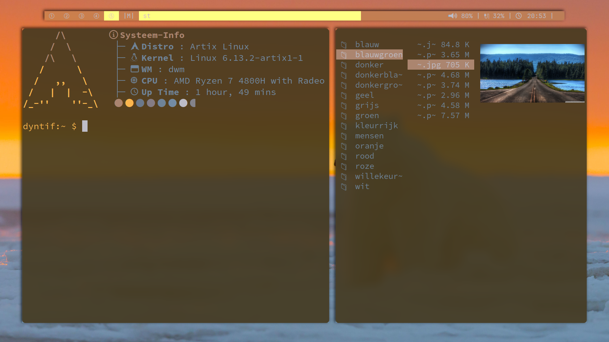

 DWM-fdn
=============
## About
**My configuration files. Trying to get as close to a "what a computer should be" setup as possible.**
**Put this on GitHub for myself to clone when on a new system, and as a backup. Maybe some inspiration could be taken from this, mainly the way I pulled off the theming.**
    
<video controls>
  <source src="screenshots/demo.mp4" type="video/mp4">
  Je browser ondersteunt geen video.
</video>


I use Artix Runit Linux, and started with a base DWM install. I use ST and dmenu application launcher. 

I wrote a script that (mainly just by using wal and some patches) gives you a menu to pick a color, and it completely changes every aspect of your systems color, instantly! Within the same runtime. 
    I'm using the same technique for executing standard commands like emptying your Vim cache and opening some files. 
    Not all the files relating to these features are in the repo atm.

    
## efficiency
Let's talk optimal binds, there's three 'levels' of binds
- DWM system binds: super=MODKEY
- ST meta-terminal binds: alt=MODKEY
- bash in terminal binds: ctrl=MODKEY


### DWM binds in config.h
I put the keys in alphabetic order in the config.h file.
**fundamental movement**
    
    
```
mod + j; move focus to left client
mod + k; move focus to right client
mod + J; move client to the right
mod + K; move client to the left
Or up and down depending on layout and how many clients are open obviously
mod + l; make client stretch to the right
mod + h; make client stretch to the left

mod +';';move to next tag
mod + g; move to previous tag
mod +'.'; move client to next tag
mod + G; move client to previous tag

mod + 1234567890; switch to this tag (azerty keys)
mod + shift_1234567890; move client to this tag (azerty keys)

mod + n; move to monitor on the left
mod + N; move to monitor on the right
mod + shift_Right; move tag to monitor on the right
mod + shift_Left; move tag to monitor on the left
```

**other keys of note**
```
mod + a; toggle gaps
mod + d; run dmenu
mod + s; run a script that gives you a dmenu menu, select an action that you have defined in the script to run.
mod + x; select a colorscheme! Runs a script that runs dmenu and can then update your entire theme completely, including the dmenu bar, which was difficult to get to work.
mod + z; menu to reboot, poweroff, or restart dmenu.

there's other keys like q to close clients, S for taking screenshots, and more.

I won't mention all of them, it's in the config.h
```

### ST-binds
```
mod + J; zoom out
mod + K; zoom in
mod + j; scroll up
mod + k; scroll down

mod + a; decrease the terminal alpha; less transparent background
mod + s; increase the terminal alpha; more transparent background
```

### bash bound keys
```
don't have many
mod + l; clears terminal, which didn't automatically happen for me somehow

I have Vim mode enabled: set -o vi
qj exits to normal mode
all other settings are as in regular vim

mod + r; opens ranger
mod + n; opens newsboat

some aliases
v=vim
e=exit
...
```

### Be attentive to
- I have an azerty key configuration. Some keys in the config.h might need to be changed if you'd use it with a different layout.
- Downloads folder was renamed 'dl'.


